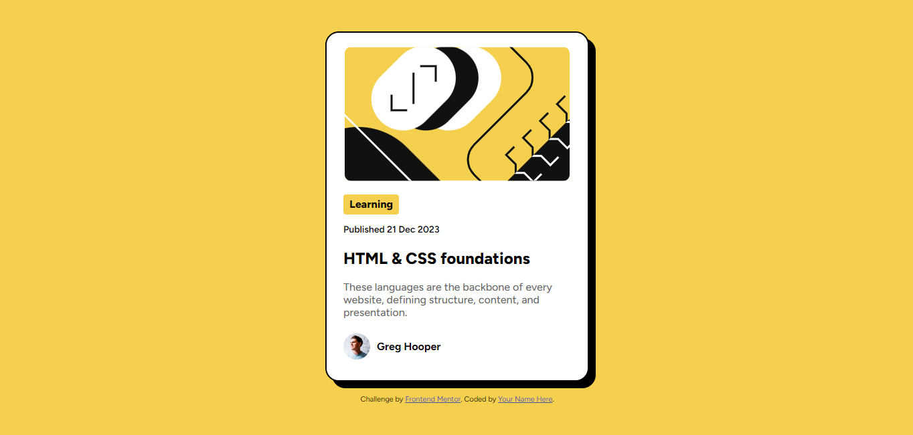

# Frontend Mentor - Blog preview card solution

This is a solution to the [Blog preview card challenge on Frontend Mentor](https://www.frontendmentor.io/challenges/blog-preview-card-ckPaj01IcS). Frontend Mentor challenges help you improve your coding skills by building realistic projects. 

## Table of contents

  - [The challenge](#the-challenge)
  - [Screenshot](#screenshot)
  - [Links](#links)
  - [Built with](#built-with)
  - [What I learned](#what-i-learned)
  - [Continued development](#continued-development)
  - [Useful resources](#useful-resources)
- [Author](#author)

### Screenshot



### Links

- Solution URL: [Add solution URL here](https://www.frontendmentor.io/challenges/blog-preview-card-ckPaj01IcS)
- Live Site URL: [Add live site URL here](https://your-live-site-url.com)

### Built with

- Semantic HTML5 markup
- CSS custom properties
- Flexbox
- CSS Media Queries 

### What I learned

```html
<svg> illustration</svg>
```
```css
@media screen and (max-width: widh){
    
}
line-height:px;
```

### Continued development

- grid css
- JS
- bootstrap

### Useful resources

- [Example resource 1](https://www.cssmatic.com/box-shadow) - This helped me to make a box-shadow

## Author

- Frontend Mentor - [@anwar-elbarry](https://www.frontendmentor.io/profile/anwar-elbarry)
- Twitter - [@elbarryAnwar](https://x.com/elbarryAnwar)
